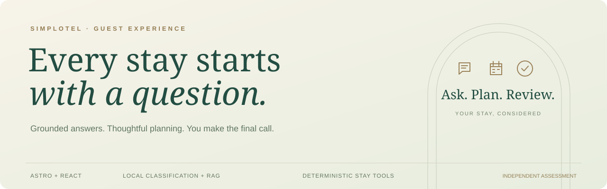

<p align="center">
  
</p>

<h1 align="center">Simplotel Guest Concierge</h1>

<p align="center">A hotel assistant that answers with evidence and prepares a stay for your review.</p>

<p align="center">
  <a href="https://github.com/Itachi-1824/simplotel-guest-concierge/actions/workflows/ci.yml"></a>
  
  
  
</p>

<p align="center">
  <a href="#run">Run locally</a> ·
  <a href="docs/requirements.md">Assessment checklist</a> ·
  <a href="docs/evaluation.md">Test evidence</a> ·
  <a href="LICENSE">Evaluation license</a>
</p>

> **Independent assessment concept.** The Cove Hotel, contacts, rates, and inventory are fictional sample data. No real reservation or payment is made; this is not an official Simplotel service.

## The experience

| For the guest | Behind the scenes |
| --- | --- |
| Full-page conversation with source labels | 42 hotel facts and 28 reviewed graph relationships |
| Dates and preferences in one message | LLM tool arguments, local classification, validated availability |
| Automatic stay report before confirmation | Rechecked rates, matching options, clear exclusions |
| Saved chats, folders, export, and replayable guide | Browser-local persistence; no account required |
| Mobile layout, arrival reveal, optional sound | Astro + React, reduced-motion support |
| Hotel contact and area information | Clearly labelled demonstration contacts |

<details>
<summary><strong>View the fictional hotel visual</strong></summary>
<br />

<p><em>The app uses this fictional property illustration; it is not a photograph of a real hotel.</em></p>
</details>

## Review in five minutes

1. Ask “What time is check-in?” from the landing page.
2. Ask about the Terrace Suite, then “And breakfast?”
3. Ask “Do you have a helipad?” to see the grounded fallback.
4. Say “Book a room 5–7 October 2026 for three guests under €400 per night with a terrace and with breakfast included.” Use future dates if this example has expired. Review the automatically prepared stay report, then confirm the payment preview.
5. Open the sidebar; rename, file, archive, restore, or export a conversation.
6. Open **Hotel & contact** to copy labelled demo details and view the Amalfi area.
7. Replay the walkthrough with **Guide** in the chat header or mobile conversation bar.

Chats and folders are stored on the current device. Clearing browser storage removes them. No reservation or payment is made. The payment handoff is a labelled preview; a real booking/payment provider must be integrated before collecting money.

**All hotel data is stub data.** [Sample fixtures and expected reviewer results](docs/demo-data.md) cover 42 hotel facts, four room categories, 28 graph relationships, 16 complex retrieval scenarios, availability, and failure handling.

## Run

Requires Node.js 22.19+ and npm. Tested with Node 24.13.1.

```sh
npm ci
npm run dev
```

Open **http://localhost:4321**. The complete frontend and backend work without API keys. Hotel answers use the bundled knowledge base; room availability uses deterministic sample inventory.

## How the assistant works

**The external LLM is used only for chat interactions:** it interprets guest phrasing into structured requests and selects relevant sentences from trusted hotel evidence. Code validates the interpretation, checks inventory, calculates prices, and prepares the review. The LLM cannot reserve a room or take payment.

**Laya is a local classifier, not an LLM or a text generator.** It runs on the application’s machine/VPS. Its classification inputs stay in that local inference process; they are not sent to a hosted Laya API.

| Responsibility | Implementation |
| --- | --- |
| Free-form booking language and contextual corrections | GPT function calls with typed arguments; local parsing fallback |
| Hotel-question intent, candidate-query selection | Local Laya, with code fallback |
| Evidence relevance | Local Laya signal, bounded before ranking |
| Room view and breakfast preferences | Local Laya classification; validated choices displayed for review |
| Graph suggestions | Offline Laya proposals; reviewed edges only become active |
| Find supporting facts | BM25, local MiniLM embeddings, FlashRank, rank fusion, reviewed graph relationships |
| Chat answer wording | Optional LLM sentence selection; server renders only valid source sentences |
| Date, guest-count, budget and capacity validation | Ordinary deterministic code |
| Availability, lowest matching sample rate, totals, quote/report | Ordinary deterministic code |
| Session controls, folders, guide, contact panel, UI | Ordinary application code |

### If the LLM fails

Transient provider failures get one retry with a fresh seed and short randomized backoff. Both attempts count toward the provider allowance. Content-filter rejections, invalid requests and authentication errors are not retried. Refused requests receive a polite redirect to hotel help. Known role overrides are excluded from later interpretation history.

The application still works: local Laya can classify and help retrieve the right information, while code returns grounded source answers and runs the mock availability/quote tools. Laya does not generate replacement prose or invent missing information. It cannot supply unknown facts, research changing real-world prices, or confirm external live availability. If all local models are unavailable, the built-in BM25/feature-hash retrieval and deterministic tools remain available. Unsupported questions receive a clear fallback; uncertain special requests require hotel confirmation.

### Data handling

Local classification, embeddings, and reranking run on the VPS. When the external LLM is enabled, **language interpretation sends the current question, active stay/preferences, and up to three recent guest messages to the configured provider**. Answer selection sends the current question and selected hotel excerpts. The entire saved conversation is not sent. Optional provider embeddings are a separate opt-in configuration. API keys remain server-side. The public app uses HTTPS and keeps the model service on loopback. Request logs record outcome and duration rather than message contents.

Chats and folders stay in browser local storage and are not encrypted by the app. The demo collects no card details and uses no real guest records. Local inference keeps classification inputs on your server. Questions sent to an external LLM are subject to that provider’s data policy.

## Stay planning

Give dates, guests, and preferences in one message. Missing essentials are requested together in chat; the optional form fills automatically. GPT interprets unfamiliar phrasing and corrections; Chrono parses natural dates in hotel-local time. Local Laya classifies room view and breakfast preferences. Code validates every stay, filters the four sample room categories, and selects the lowest matching nightly rate. A server-generated report shows the checks, preferences, alternatives, selection reason, cost, and exclusions before confirmation.

**Laya is a local classifier, not an LLM.** Its choices are bounded hints, never the authority for availability, capacity, dates, or prices. This is also declared in `LAYA_ROLE` in the Node and Python code.

The brief branded arrival reveal respects reduced motion. Sound is opt-in, plays a confirmation chime when enabled, and remembers the setting on this device.

## Enable local AI

Python 3.11 or 3.12 is recommended. First installation downloads model weights; allow several minutes and several GB of disk space. CPU inference is supported.

Windows PowerShell:

```powershell
py -3.12 -m venv .venv
.venv\Scripts\python -m pip install -r model_service/requirements.txt
npm run ai:warmup
npm run dev:ai
```

macOS / Linux:

```sh
python3 -m venv .venv
.venv/bin/python -m pip install -r model_service/requirements.txt
npm run ai:warmup
npm run dev:ai
```

Stop an existing `npm run dev` before `dev:ai`. The local service loads MiniLM, FlashRank, and Laya on port **8001**. Wait for its “Application startup complete” message. Check model status at **http://127.0.0.1:8001/health**. Downloads are cached in `.cache/`; weights are not committed. If the service is unavailable, the application falls back to built-in retrieval.

## Connect an LLM

Copy `.env.example` to `.env`, then set:

```dotenv
OPENAI_API_KEY=your-key
OPENAI_BASE_URL=https://api.openai.com/v1
OPENAI_MODEL=gpt-4.1-mini
```

Restart the app. A compatible provider must support `/chat/completions`, function calling, and JSON object responses. GPT calls `prepare_stay`, `search_hotel_information`, `ask_guest`, or `decline_request`. The server validates the arguments and executes the local pipeline. Multi-source answers use a separate constrained sentence-selection call. Single-fact answers and explicit availability requests remain usable without a provider. Unresolved language asks for clarification when interpretation fails.

The live demo uses Pollinations: `OPENAI_BASE_URL=https://gen.pollinations.ai/v1`, `OPENAI_MODEL=openai/gpt-5.4-nano`, `OPENAI_TIMEOUT_MS=12000`, and `OPENAI_MAX_TOKENS=24000`. Supply your own key in `.env`. See the [five-model comparison](docs/evaluation/provider-models.json), which preserves the original benchmark and selection before this switch.

`LOCAL_AI_URL` can connect a separately running model service. `LAYA_ENABLED=0` disables Laya while retaining local embeddings and reranking. Optional `npm run embeddings` builds a provider embedding index; local MiniLM requires no provider key.

The live output allowance is 24,000 tokens. This is a ceiling; the constrained evidence-selection response remains short. The provider comparison used 1,200 tokens and remains recorded with its original settings.

## Check the submission

```sh
npm test
npm run eval
npm run build
npm run test:api
```

`test:api` requires the application running on port 4321. With the local service running:

```sh
npm run eval -- --local
npm run test:python
```

Observed results and known limits are in [Evaluation](docs/evaluation.md). Use [Requirements](docs/requirements.md) to review every PDF requirement. The exploratory local evaluation includes a known unsupported paraphrase and reports it as a failure rather than concealing it.

Current coverage includes **112 Node tests**, **15 general HTTP checks**, **13 booking conversation HTTP checks**, and **16 complex fixture scenarios**. Booking checks cover guest corrections, shorthand dates, saved stay context, nearby dates, and quote validation. The optional `node --env-file=.env scripts/evaluate-language.mjs` makes paid requests for 12 language scenarios. Earlier failed prompt trials and retrieval misses remain in the evaluation reports. A [single adversarial browser journey](docs/evaluation/adversarial-e2e.md) records corrections, policy questions, attempted overrides, reload and payment preview, including the failures found and fixed.

## Production build

```sh
npm run build
npm start
```

The Node server defaults to port 4321. Set `HOST` and `PORT` as needed. `.env` is loaded at startup. The Python service runs separately for local AI; `LOCAL_AI_URL` must be reachable from the Node server. This application uses the Node adapter, not a static hosting adapter.

## Documentation

| Read next | Contents |
| --- | --- |
| [Laya evaluation](docs/laya.md) | Usage, calibration checks, errors, and load results |
| [Architecture](docs/architecture.md) | Data flow, RAG, graph, model boundaries, failure handling |
| [API](docs/api.md) | Chat, preferences, quotes, response contracts |
| [Assessment checklist](docs/requirements.md) | PDF requirements mapped to implementation |
| [Sample data](docs/demo-data.md) | Fixtures, complex queries, expected reviewer results |
| [Evaluation](docs/evaluation.md) | Reproducible checks and known limitations |
| [Deployment](docs/deployment.md) | Isolated VPS setup, environment, cleanup |
| [Credits](docs/credits.md) | Branding, models, assets, and AI development tools |

## License

Copyright © 2026 Itachi-1824. This source-available project is provided under the [Assessment Evaluation License](LICENSE). Simplotel and its authorized hiring reviewers may clone, run, inspect, test, and modify it for this assessment. Product use, commercial reuse, and redistribution beyond that evaluation require prior written permission. Third-party components and branding retain their respective rights and licenses.

---

OpenAI Codex assisted with implementation, research, and testing. OpenAI image generation produced the fictional hotel illustrations and concierge monogram. Attribution and trade-offs are documented in [Credits](docs/credits.md).
