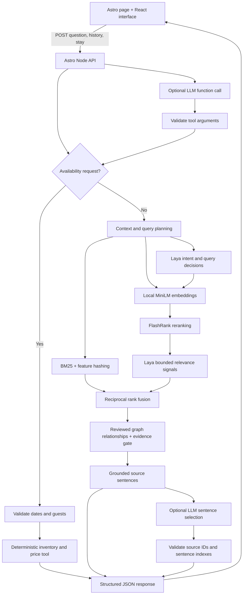

# Architecture and decisions

## Product and UX

Guests need reliable answers before choosing a room. The journey moves from a hotel introduction straight into a full-page conversation, with hotel discovery one scene further on. A stay planner collects dates and guest count without losing the conversation.

The mobile composer remains visible while messages scroll. Short screens receive a compact welcome; larger screens include photography. Teal provides a calm visual anchor, warm ivory reduces stark contrast, and muted brass distinguishes secondary accents. These are design hypotheses, not claims that a colour guarantees bookings. Motion respects reduced-motion preferences; sound is opt-in.

Sessions have automatic titles, manual rename, archive/restore, delete confirmation, search, and Markdown export. Folders group travel plans without introducing account setup. A replayable seven-step tour introduces the controls. Local persistence is a deliberate assessment simplification, not a substitute for secure accounts.

## AI boundaries

The JSON knowledge base contains 42 facts and four room types. BM25 provides a fast baseline. MiniLM adds semantic retrieval, FlashRank reranks eight candidates, and reciprocal rank fusion combines signals. A small reviewed graph connects room entities to policies. This is one-hop graph-assisted RAG, not a community-summary GraphRAG implementation.

Laya is a local classifier, not a text generator. It classifies intent, chooses among supplied query candidates, and judges candidate relevance. Its influence is capped; it cannot invent facts, prices, inventory, or graph edges. `npm run graph:propose` produces offline graph suggestions in `.cache/graph-proposals.json` for human review. It never changes the active graph.

Availability, date arithmetic, capacity limits, and prices are ordinary code. The optional LLM interprets conversational requests into typed tool arguments, and selects sentence indexes from retrieved sources. Invalid fields, source IDs, incomplete selections, and invented prose are rejected. Explicitly parsed guest counts take precedence over model proposals. Ambiguous instructions prompt clarification without replacing the active stay.

The parser requests exactly one OpenAI-compatible function call with parallel calls disabled. Allowed functions are `prepare_stay`, `search_hotel_information`, `ask_guest`, and `decline_request`. Code validates the tool name, argument keys, field types, and allowed values before dispatch. A stay tool invokes local validation and mock inventory; a search tool invokes RAG. The model has no payment, reservation, shell, or external browsing tool. No arbitrary function name can execute code.

## Failure handling

| Failure | Behaviour |
| --- | --- |
| Missing dates or guests | Ask for all missing essentials in chat; fill the optional form |
| Invalid dates/capacity | Explain the validation error |
| Unknown or ambiguous question | Abstain or ask for clarification |
| Local model unavailable | Eight-second timeout; baseline retrieval; 15-second circuit breaker |
| Transient LLM failure | One retry, fresh seed, short randomized backoff; 12-second timeout per attempt live; each attempt uses the provider allowance |
| LLM unavailable/invalid after retry | Local handling and complete source facts; uncertain requests ask for clarification |
| Provider content filter / role override | Polite refusal and hotel redirect; no retry; refused overrides omitted from later interpretation history |
| Frontend request fails | Visible error, preserved messages, retry control |
| Browser storage unavailable | Continue in memory; show saving unavailable |

Grounding prevents invented wording, but retrieval can still select the wrong fact, omit a qualification, or miss a paraphrase. Laya confidence is not a calibrated probability. The evaluation includes negative and ambiguous cases; more models alone do not establish better quality.

## Measurement and production work

Measure answer correctness, source relevance, unsupported-answer rate, clarification success, availability completion, latency, and guest helpfulness feedback. In a controlled rollout, compare direct-booking completion against a control group; avoid attributing all conversion changes to chat.

Before production: connect a real booking system, tenant-scoped data and authentication, encrypted server persistence, rate limiting, monitoring, content versioning, human handoff, provider privacy controls, broader multilingual and accessibility testing, and calibrated retrieval thresholds. Current inventory is deterministic mock data; there is no payment or booking operation.

## Autonomous demo stay planning

`query-plan.mjs` parses ISO or natural English dates with Chrono, using the hotel’s Europe/Rome calendar. Ambiguous slash dates require clarification. `room-preferences.mjs` combines explicit inputs with bounded Laya outlook/breakfast classifications. `/v1/booking-intent` runs locally, separately from retrieval, with a 3.5-second client timeout and a deterministic fallback. Laya is a local classifier, not an LLM; `LAYA_ROLE` exposes this distinction in code and service health.

Laya preference choices require a normalized winning score ≥ .90, a ≥ .30 margin, and entropy confidence ≥ .10. These are acceptance gates, not calibrated probabilities. Uncertain or malformed choices cannot alter the plan. Explicit form values win. Selected preferences remain visible for guest review. The LLM interpreter is a separate optional language layer; its output cannot bypass validation or quote calculations.

Code checks capacity, every night’s mock inventory, numeric budgets, documented views, and breakfast inclusion. Matching rooms are sorted by sample nightly price. A complete chat request opens a review automatically; a structured form request offers room comparison first. `/api/quote` recomputes the price and availability, ignores client totals, verifies preferences, and supplies the report. Confirmation rechecks the quote before the payment preview. No reservation, room hold, external hotel search, personal-data collection, or payment operation exists.
