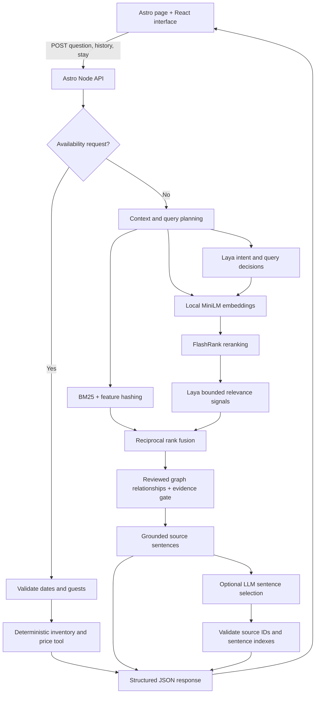

# Architecture and decisions

## Product and UX

Guests need reliable answers before choosing a room. The journey moves from a hotel introduction straight into a full-page conversation, with hotel discovery one scene further on. A stay planner collects dates and guest count without losing the conversation.

The mobile composer remains visible while messages scroll. Short screens receive a compact welcome; larger screens include photography. Teal provides a calm visual anchor, warm ivory reduces stark contrast, and muted brass distinguishes secondary accents. These are design hypotheses, not claims that a colour guarantees bookings. Motion respects reduced-motion preferences; sound is opt-in.

Sessions have automatic titles, manual rename, archive/restore, delete confirmation, search, and Markdown export. Folders group travel plans without introducing account setup. A replayable seven-step tour introduces the controls. Local persistence is a deliberate assessment simplification, not a substitute for secure accounts.

## AI boundaries

The JSON knowledge base contains 14 facts and four room types. BM25 provides a fast baseline. MiniLM adds semantic retrieval, FlashRank reranks eight candidates, and reciprocal rank fusion combines signals. A small reviewed graph connects room entities to policies. This is one-hop graph-assisted RAG, not a community-summary GraphRAG implementation.

Laya is a local classifier, not a text generator. It classifies intent, chooses among supplied query candidates, and judges candidate relevance. Its influence is capped; it cannot invent facts, prices, inventory, or graph edges. `npm run graph:propose` produces offline graph suggestions in `.cache/graph-proposals.json` for human review. It never changes the active graph.

Availability, date arithmetic, capacity limits, and prices are ordinary code. The optional LLM selects sentence indexes from retrieved sources. Invalid IDs, incomplete selections, and invented prose are rejected. Every displayed answer has source labels or an explicit fallback.

## Failure handling

| Failure | Behaviour |
| --- | --- |
| Missing dates or guests | Open the stay planner; retain conversation |
| Invalid dates/capacity | Explain the validation error |
| Unknown or ambiguous question | Abstain or ask for clarification |
| Local model unavailable | Eight-second timeout; baseline retrieval; 15-second circuit breaker |
| LLM unavailable/invalid | Seven-second timeout; render complete source facts |
| Frontend request fails | Visible error, preserved messages, retry control |
| Browser storage unavailable | Continue in memory; show saving unavailable |

Grounding prevents invented wording, but retrieval can still select the wrong fact, omit a qualification, or miss a paraphrase. Laya confidence is not a calibrated probability. The evaluation includes negative and ambiguous cases; more models alone do not establish better quality.

## Measurement and production work

Measure answer correctness, source relevance, unsupported-answer rate, clarification success, availability completion, latency, and guest helpfulness feedback. In a controlled rollout, compare direct-booking completion against a control group; avoid attributing all conversion changes to chat.

Before production: connect a real booking system, tenant-scoped data and authentication, encrypted server persistence, rate limiting, monitoring, content versioning, human handoff, provider privacy controls, broader multilingual and accessibility testing, and calibrated retrieval thresholds. Current inventory is deterministic mock data; there is no payment or booking operation.
